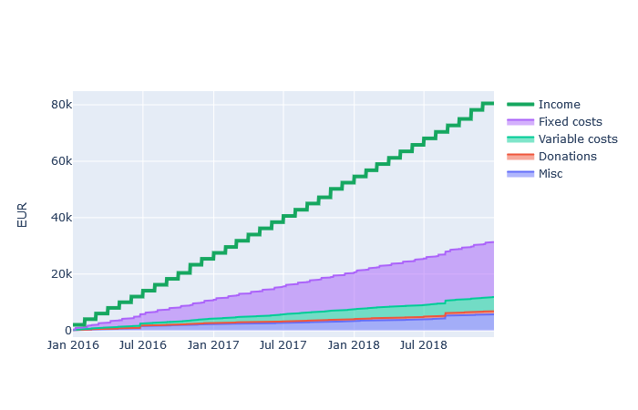

# expenses-report
Keeps track of your personal expenses.
* visualizes your expenses by different categories
* reads transactions from csv files exported from your bank account
* automatically assigns categories to your expenses
* define your own categories
* outputs an interactive html report

---

## Table of Contents
1. [Requirements](#requirements)
1. [Example](#example)
1. [Usage](#usage)

---

## Requirements
* Python 3.x
* Pandas
* Plotly

## Example
For an interactive report demonstration see [sample/sample-report.html](https://kircher-sw.github.io/expenses-report/sample/sample-report.html)

### Categories grouped by month


### Categories grouped by year


### Categories as a pie-chart


### All transactions cumulated by categories


## Usage
1. Clone repository
2. Adapt the file **expenses_report/config.py**
  * define path to folder with csv files (either absolute or relative to project)
  ```python
  CSV_FILES_PATH = 'sample'
  ```
  * specify column names of csv files
  * define categories with keywords
3. execute **run.py**

