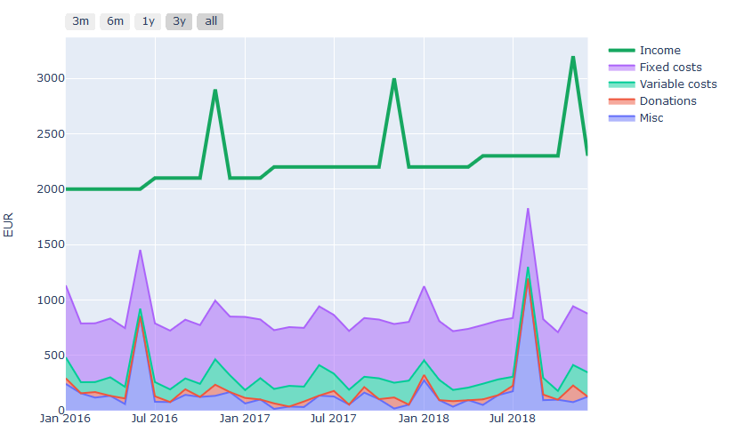
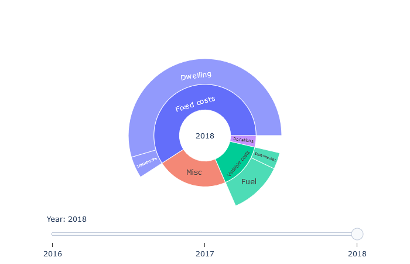

# expenses-report
Keeps track of your personal expenses.
* visualizes your expenses by self defined categories
* reads transactions from CSV files exported from your bank account
* automatically assigns categories to your expenses
* outputs an interactive html report

---

## Table of Contents
1. [Requirements](#requirements)
1. [Example](#example)
1. [Usage](#usage)

---

## Requirements
* <a href="https://www.python.org/downloads" target="_blank">Python</a> >= 3.6
* <a href="https://pandas.pydata.org/pandas-docs/stable/install.html#installing-from-pypi" target="_blank">Pandas</a> >= 0.24.2
* <a href="https://plot.ly/python/getting-started/#installation" target="_blank">Plotly</a> >= 3.8.1

## Example
For an interactive report demonstration see [sample/sample-report.html](https://kircher-sw.github.io/expenses-report/sample/sample-report.html)

### Monthly expenses


### Annual expenses



### Accumulated expenses


### All expenses


## Usage
1. Clone repository
1. Adapt the file [**expenses_report/config.py**](expenses_report/config/config.py)
    * define the path to the folder which contains your CSV files (either absolute or relative to the project directory)
      ```python
      CSV_FILES_PATH = 'sample'
      ```
    * specify column names of the CSV files in the `import-mapping` dictionary
      ```python
      import_mapping = {
        DATE_COL: ['Date', 'Valuta'],
        ...
      }
      ```
    * define `categories` of interest and add keywords as they occur in your transactions
      ```python
      categories = {
        ...
        'Car': ['Fuel', 'Garage', ...],
        ...
      }
      ```
1. execute [**run.py**](run.py)
    * the script outputs a list of all uncategorized transactions on the command line for further refinement of the keywords
 
